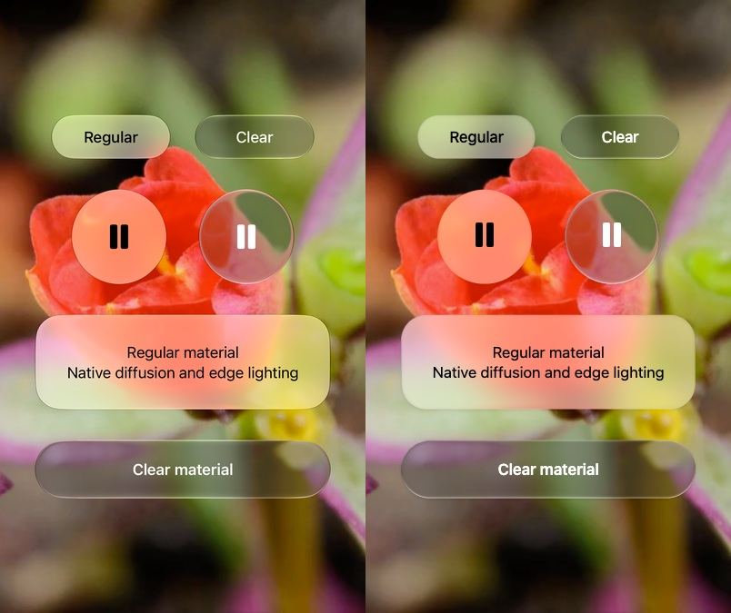
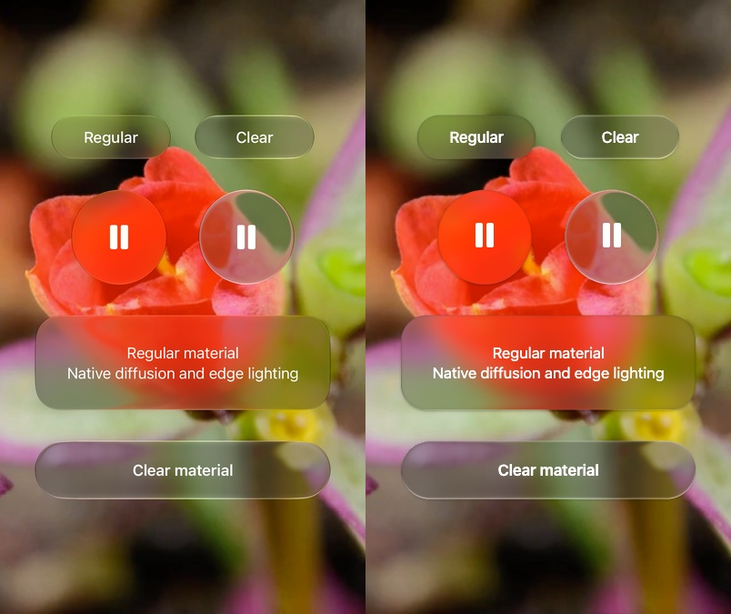
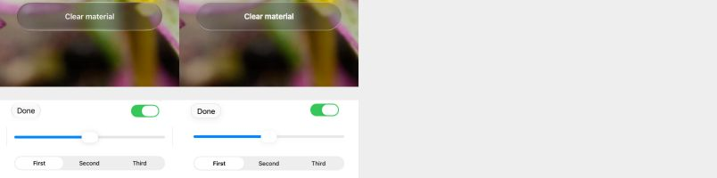

# iOS 27 visual reference

Prism Glass `0.4.0-alpha.1` uses native iOS 27 as its visual target. Aave supplies the source/SVG/media rendering principle, not the colors, lens proportions or material strength.

## Official sources

- [Apple HIG: Materials](https://developer.apple.com/design/human-interface-guidelines/materials): regular/clear roles, legible foregrounds, restrained placement and avoiding glass on glass.
- [WWDC26 Platforms State of the Union](https://developer.apple.com/videos/play/wwdc2026/102/): increased diffusion of complex backgrounds, darker contours, brighter specular edges, and user control over glass tint.
- [iOS 27 appearance settings](https://support.apple.com/en-sg/guide/iphone/iphd6804774e/27/ios/27): the Liquid Glass slider ranges from clearer to more tinted.

These sources do not specify a Gaussian radius, refraction displacement, shader coefficients or exact animation spring constants. The numbers below are this library's calibrated web values, not Apple constants. The implementation does not copy or invoke Apple's private shader.

## Reference procedure

A small [SwiftUI reference app](visual/NativeReference.swift) was built with Xcode 27.0 (27A266a), using an already installed iOS 27.0 (24A434) iPhone 18 Pro simulator. It uses `.buttonStyle(.glass)`, native Toggle/Slider/segmented Picker, `.glassEffect(.regular)` and `.glassEffect(.clear)` with no custom native blur or refraction. The clear examples have an explicit 35% black backdrop, matching the bright-media use case.

The same CC0 flower frame was supplied to SwiftUI and the web renderer. Native captures were 1206 × 2622 pixels at 3× density; the material content crop is 1206 × 2025, normalized to 402 × 675 CSS pixels. Status bars, navigation bars and simulator chrome are excluded. Web comparisons were inspected in the Codex in-app browser at the same CSS sizes. The current saved comparisons use deterministic Chromium captures at 2× runtime DPR, normalized to CSS pixels; the separate native control montage remains from the earlier comparison.

Left is native SwiftUI; right is the live web implementation:

The focused control comparison combines crops from separate native Form rows. Both columns use the same CSS scale; it is not a comparison of entire screen layouts.

## Optical correction in 0.4

The earlier narrow-rim fit was insufficient: a nominal strength of 7 with bevel 9 and curvature 4 produced only a few pixels of displacement at the very edge, which the Clear blur masked. The corrected fit uses a much broader roundover. For the 104px Clear circle, the fitted web values are strength 64, bevel 52, curvature 6.5; the circle's center stays quiet while the flower edge bends inward.

The browser regression compares the actual rendered ring (3–23 CSS pixels inside that circle, excluding the icon and specular boundary) to the registered native image. It requires normalized RGB RMS error below 0.035 and below 70% of the former narrow-rim result. This tests one known optical scene, not a universal percentage of native fidelity. The same check runs in Chromium, Firefox and WebKit.

Regular diffusion is now separated by shape and panel appearance instead of applying a 14px base and then increasing it again for every panel preset. Existing switch/slider optical parameters remain fixed.

## Resulting defaults

| Surface | Web default |
| --- | --- |
| Regular | At `tintLevel=0.5`: 8px circular, 12px capsule, 14px light panel / 10px dark panel diffusion before purpose-specific multipliers; size-aware neutral fill and vibrancy |
| Clear | 1.5px small-kernel diffusion; saturation 1.1; small neutral reflection; 35% local dimming |
| Refraction | Broad rounded field with a quiet center; size-aware strength up to 64 for Clear / 28 for Regular, bevel up to half the short side (64px cap), curvature 2–8 before role multipliers. Strength is an optical scale, not the displacement at every pixel. |
| Edge | Thin dark contour and directional top/bottom glints; no default chromatic fringe |
| Standard button | 34px visual capsule; 44px hit height; 17px system font at regular weight |
| Circular button | 32px visual circle inside a 44px hit target; larger media controls explicitly override visual height |
| Switch | 64 × 28px track inside a 64 × 44px target; 36 × 24px white capsule thumb; green `#34c759` |
| Slider | 6px track; 36 × 26px white capsule thumb; blue `#0088ff`; 44px interaction height |
| Segmented tabs | 32px background and 28px selection inside a 44px target |

The regular material uses two separable 25-tap Gaussian passes on a bounded shared texture. Lenses with the same blur reuse that field during a frame. This avoids the visible repeated samples produced by a sparse nine-tap blur at large radii. Small optical blurs keep the cheaper path. Diffusion textures are discarded when unused and released on teardown/context restoration.

`<GlassProvider tintLevel={0.5}>` selects the default. `tintLevel` can be overridden on a component or media scene, with 0–1 controlling regular opacity/diffusion. This is a web preference; it does not read or change the OS preference. Clear retains its separate media treatment.

## Limits

Native glass adapts to context and uses proprietary compositing. Fine edge thickness, local luminance response, SF Symbol metrics and native interaction morphing are not pixel-identical. System fonts match most closely on Apple platforms. The comparison validates these static scenes and control states, not every possible background or a physical iPhone's GPU performance.

Rebuild the local calibration fixture with `node scripts/build-calibration.mjs`, start `node scripts/serve.mjs`, and open `/calibration.html`. `?dark` selects dark materials. The fixture and its native captures are excluded from GitHub Pages; they are reference/test artifacts, not rendered screenshots used in the product.
